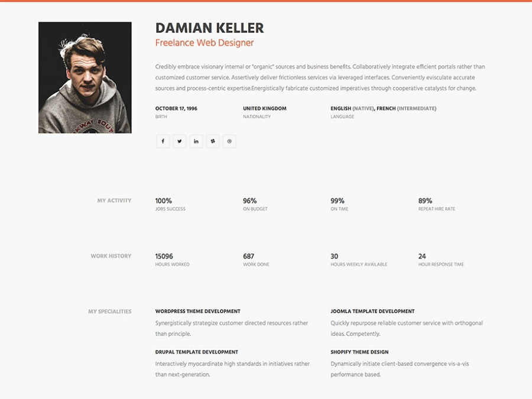

# Resume page with grid

During trainings got exercise to build provided resume webpage with grid positioning and it must be responsive to all types of screens. Also design and text must be same as in provided picture.

## Features

- Responsive design for all screen sizes using grid
- Clean and modern UI

## Tech Stack

- HTML: For stucturing content.
- CSS: For styling and responsive design.

## Installation

To run this project locally, follow these steps:

1. Clone the repository
2. Open project with Visual Studio/Visual Studio Code
3. Navigate to the project directory
4. Install all dependencies - npm install
5. Run the project locally - npm run start (if missing live-server instal - npm install live-server --save-dev)
   The application will be running at your browser.
